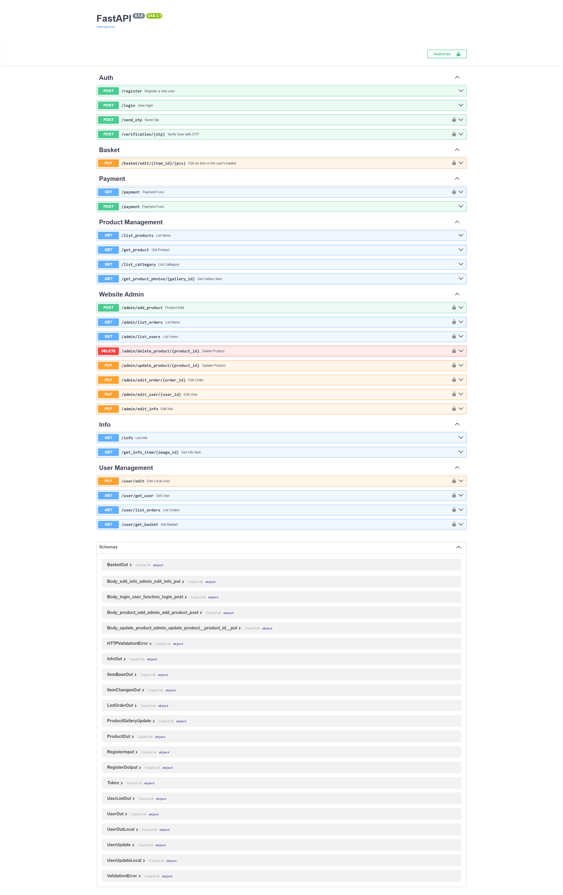

# 🛒 FastAPI E-Commerce REST API

This project is a modern and scalable **e-commerce REST API** system built with **FastAPI**. It provides complete functionality for product management, user operations, cart, orders, and **iyzico payment integration**.

## 🚀 Features

- ✅ Product listing, creation, update, and deletion
- ✅ User registration, login, and authentication (with JWT)
- ✅ Cart management
- ✅ Order creation and tracking
- ✅ **iyzico payment integration**
- ✅ Admin and user roles
- ✅ Auto-generated API documentation with Swagger (OpenAPI)
- ✅ Simple setup: works out of the box with SQLite
- ✅ **SMS verification system integration** (e.g., Twilio or NetGSM)

## 🖼️ Screenshot



## 🛠️ Installation

1. Clone this repository:
   ```bash
   git clone https://github.com/foxyscat/ecommerce-api.git
   cd ecommerce-api
   ```

2. Create a virtual environment and install dependencies:
   ```bash
   python -m venv venv
   source venv/bin/activate  # Windows: venv\Scripts\activate
   pip install -r requirements.txt
   ```

3. Create and configure a `.env` file:
   ```env
   DATABASE_URL=sqlite:///./ecommerce.db
   SECRET_KEY=your_jwt_secret_key
   IYZICO_API_KEY=sandbox-abc123456789
   IYZICO_SECRET_KEY=sandbox-secretkey123
   SMS_API_KEY=your_sms_api_key
   SMS_SENDER=YourCompany
   ```

4. The database will be created automatically. No manual migration needed (SQLAlchemy is used).

5. Run the application:
   ```bash
   uvicorn main:app --reload
   ```

## 🧺testing

```bash
pytest
```

## 📄 API Documentation

- Swagger UI: [http://localhost:8000/docs](http://localhost:8000/docs)
- ReDoc: [http://localhost:8000/redoc](http://localhost:8000/redoc)

## 📦 Built With

- FastAPI
- SQLAlchemy (with SQLite)
- Pydantic
- JWT Authentication
- Uvicorn
- iyzico API (sandbox supported)
- SMS API (e.g., Twilio, NetGSM)

## 📌 Roadmap

- [x] Product CRUD
- [x] User authentication
- [x] Cart & order features
- [x] iyzico payment integration
- [x] Admin panel (optional frontend)
- [x] **SMS verification system**
- [ ] Docker support
- [ ] CI/CD integration

## 📬 Contact

**Developer:** Bahadır Izgi  
**GitHub:** [@foxyscat](https://github.com/foxyscat)  
**Email:** izgibahadir72@gmail.com  
**LinkeIn** [Bahadır İzgi](https://www.linkedin.com/in/bahadrizgi/)
---

Licensed under the MIT License.

